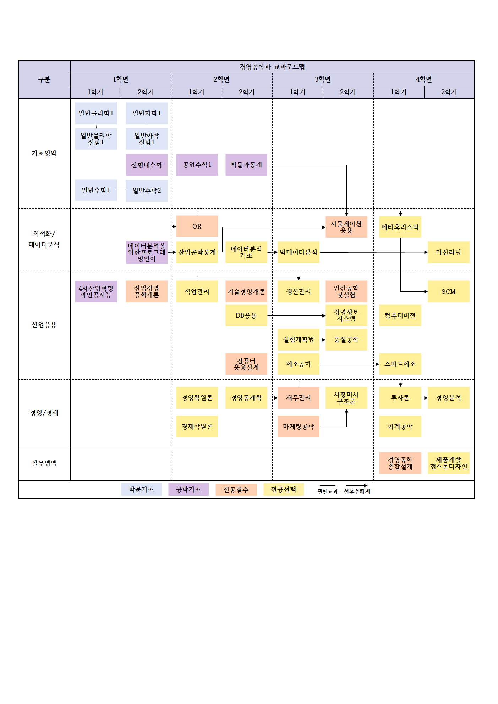

# 단국대학교 경영공학과 시간표 최적화 웹서비스

## Project Overview

단국대학교 경영공학과 학생들을 위한 시간표 최적화 웹서비스입니다. 수강신청 과정에서 학생들이 최적의 시간표 조합을 효율적으로 찾을 수 있도록 지원하며, 몇 번의 클릭만으로 개인의 선호도를 고려한 맞춤형 시간표를 제공합니다.

## How to Contribute

서비스 이용 후 웹사이트 내 피드백 시스템을 통해 사용자 경험에 대한 의견을 남겨주시면 향후 업데이트에 적극 반영하겠습니다. 실제 사용자의 피드백은 시간표 최적화 알고리즘 개선과 사용자 인터페이스 향상에 중요한 자료가 됩니다.

## Contact

프로젝트에 대한 문의사항이나 제안사항이 있으시면, 이메일로 연락 주시기 바랍니다.

---

### Development by COIS(Computational Optimization for Intelligent System)
### E-mail : seung.choi@dankook.ac.kr